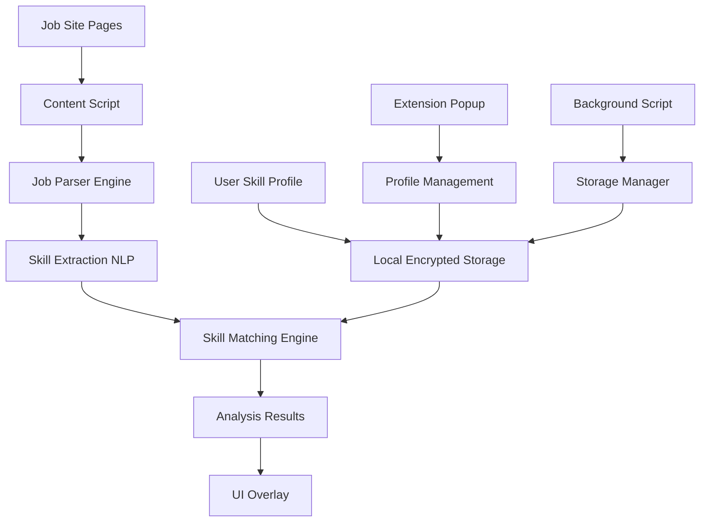

# Design Document

## Overview

The Skill Gap Analyzer is a Chrome extension built with privacy-first principles that performs all processing locally in the browser. The extension uses client-side natural language processing to analyze job postings and compare them against user skill profiles stored in encrypted local storage. The architecture emphasizes security, performance, and user experience while maintaining complete data privacy.

## Architecture

### High-Level Architecture



### Component Architecture

The extension follows a modular architecture with clear separation of concerns:

- **Content Scripts**: Inject into job site pages for DOM manipulation and analysis
- **Background Script**: Manages storage, cross-tab communication, and extension lifecycle
- **Popup Interface**: Provides user interface for profile management and settings
- **Core Engine**: Handles NLP processing, skill matching, and analysis logic

## Components and Interfaces

### 1. Content Script Layer

**JobPageDetector**
- Identifies job posting pages across different job sites (LinkedIn, Indeed, Glassdoor, etc.)
- Uses URL patterns and DOM structure analysis
- Triggers analysis when job content is detected

**JobContentExtractor**
- Extracts job description text from various job site layouts
- Handles dynamic content loading and SPA navigation
- Normalizes content format for consistent processing

**UIOverlayRenderer**
- Renders skill gap analysis results as overlay on job pages
- Provides interactive elements for viewing detailed analysis
- Handles responsive design across different job site layouts

### 2. Core Processing Engine

**SkillExtractionEngine**
- Uses client-side NLP library (compromise.js or similar) for text processing
- Maintains skill taxonomy database for accurate skill identification
- Categorizes skills by type (technical, soft skills, tools, certifications)
- Handles skill synonyms and variations (e.g., "JS" vs "JavaScript")

**SkillMatchingEngine**
- Compares extracted job skills against user profile
- Calculates match percentages and confidence scores
- Identifies skill gaps and partial matches
- Generates prioritized recommendations

**RecommendationEngine**
- Suggests learning resources based on identified skill gaps
- Estimates time investment for skill acquisition
- Provides resume optimization suggestions
- Tracks trending skills across analyzed jobs

### 3. Data Management Layer

**ProfileManager**
- Manages user skill profile creation and updates
- Handles skill categorization and proficiency levels
- Provides import functionality for resume parsing
- Maintains skill history and progress tracking

**StorageManager**
- Implements client-side encryption for all stored data
- Manages local storage quotas and data cleanup
- Provides data export/import functionality
- Handles storage migration for extension updates

**AnalysisHistoryManager**
- Stores and retrieves saved job analyses
- Provides comparison tools across multiple jobs
- Manages data retention policies
- Generates trend analysis reports

## Data Models

### User Skill Profile
```typescript
interface UserSkillProfile {
  id: string;
  skills: Skill[];
  experience: ExperienceLevel;
  preferences: UserPreferences;
  createdAt: Date;
  updatedAt: Date;
}

interface Skill {
  name: string;
  category: SkillCategory;
  proficiency: ProficiencyLevel;
  yearsOfExperience?: number;
  certifications?: string[];
  synonyms: string[];
}

enum SkillCategory {
  TECHNICAL = 'technical',
  SOFT_SKILLS = 'soft_skills',
  TOOLS = 'tools',
  CERTIFICATIONS = 'certifications',
  LANGUAGES = 'languages'
}

enum ProficiencyLevel {
  BEGINNER = 'beginner',
  INTERMEDIATE = 'intermediate',
  ADVANCED = 'advanced',
  EXPERT = 'expert'
}
```

### Job Analysis Result
```typescript
interface JobAnalysis {
  id: string;
  jobTitle: string;
  company: string;
  url: string;
  extractedSkills: ExtractedSkill[];
  matchResults: SkillMatchResult[];
  overallScore: number;
  recommendations: Recommendation[];
  analyzedAt: Date;
}

interface ExtractedSkill {
  name: string;
  category: SkillCategory;
  importance: ImportanceLevel;
  context: string;
  confidence: number;
}

interface SkillMatchResult {
  skill: string;
  status: MatchStatus;
  userProficiency?: ProficiencyLevel;
  gap?: string;
}

enum MatchStatus {
  MATCHED = 'matched',
  PARTIAL_MATCH = 'partial_match',
  MISSING = 'missing'
}
```

## Error Handling

### Content Script Error Handling
- Graceful degradation when job sites change their DOM structure
- Fallback parsing strategies for unrecognized job site layouts
- Error reporting without compromising user privacy

### NLP Processing Error Handling
- Timeout handling for long-running analysis tasks
- Fallback to simpler parsing when advanced NLP fails
- Progressive enhancement based on available processing power

### Storage Error Handling
- Quota exceeded handling with user notification
- Data corruption recovery mechanisms
- Backup and restore functionality for critical data

## Testing Strategy

### Unit Testing
- Test skill extraction accuracy with sample job descriptions
- Validate skill matching algorithms with known datasets
- Test encryption/decryption functionality
- Verify storage management operations

### Integration Testing
- Test content script injection across major job sites
- Validate end-to-end analysis workflow
- Test UI overlay rendering on different screen sizes
- Verify cross-component communication

### Privacy Testing
- Audit all network requests to ensure no data leakage
- Verify encryption implementation
- Test data deletion functionality
- Validate local-only processing claims

### Performance Testing
- Measure analysis speed on various job description lengths
- Test memory usage with large skill profiles
- Validate extension impact on job site performance
- Test concurrent analysis across multiple tabs

### User Acceptance Testing
- Test with real job seekers on actual job postings
- Validate skill gap identification accuracy
- Test recommendation relevance and usefulness
- Gather feedback on UI/UX design

## Security Considerations

### Data Encryption
- Use Web Crypto API for client-side encryption
- Implement key derivation from user-provided passphrase
- Encrypt all stored skill profiles and analysis history
- Use secure random number generation for encryption keys

### Content Security Policy
- Implement strict CSP to prevent XSS attacks
- Whitelist only necessary external resources
- Use nonce-based script execution where needed
- Regular security audits of extension permissions

### Privacy Protection
- No external API calls for core functionality
- Local-only skill databases and NLP models
- Clear data retention policies
- User-controlled data export and deletion

## Performance Optimization

### Client-Side Processing
- Lazy loading of NLP models to reduce initial load time
- Web Workers for CPU-intensive analysis tasks
- Caching of processed results to avoid re-analysis
- Efficient DOM querying and manipulation

### Memory Management
- Cleanup of analysis results after user navigation
- Efficient storage of skill databases
- Garbage collection of temporary processing data
- Memory usage monitoring and optimization